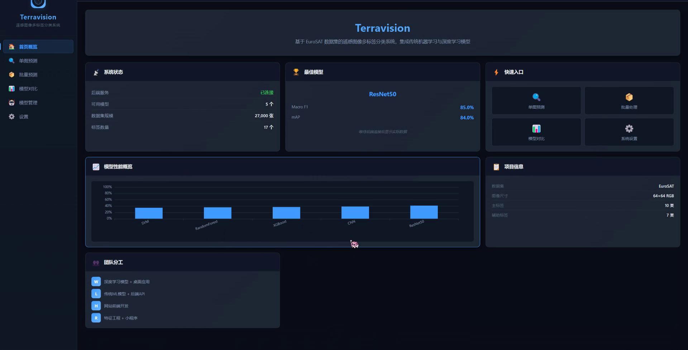
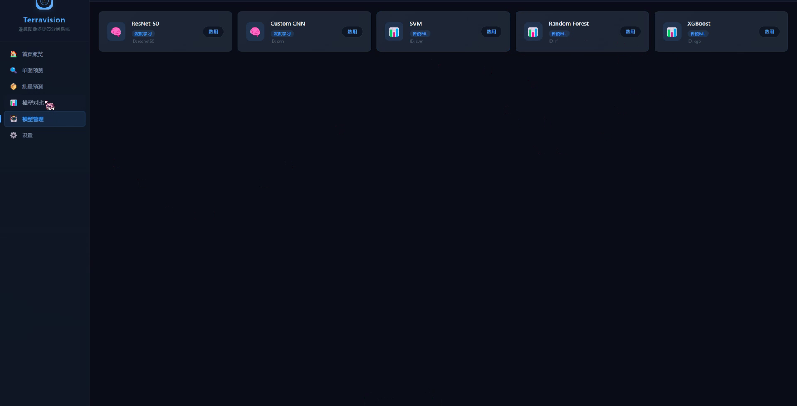
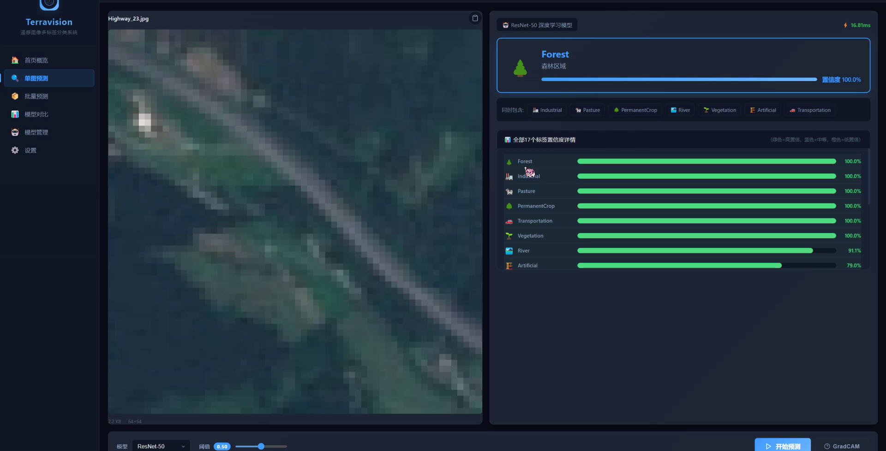
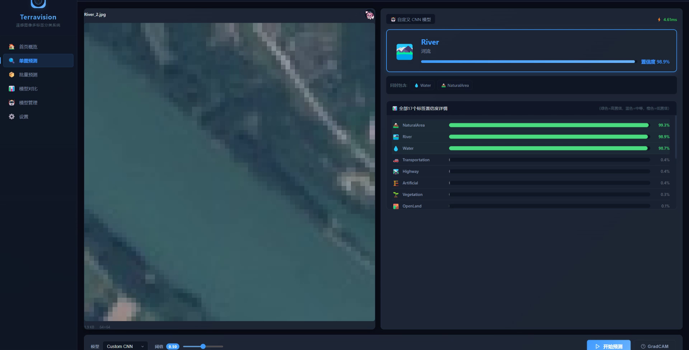
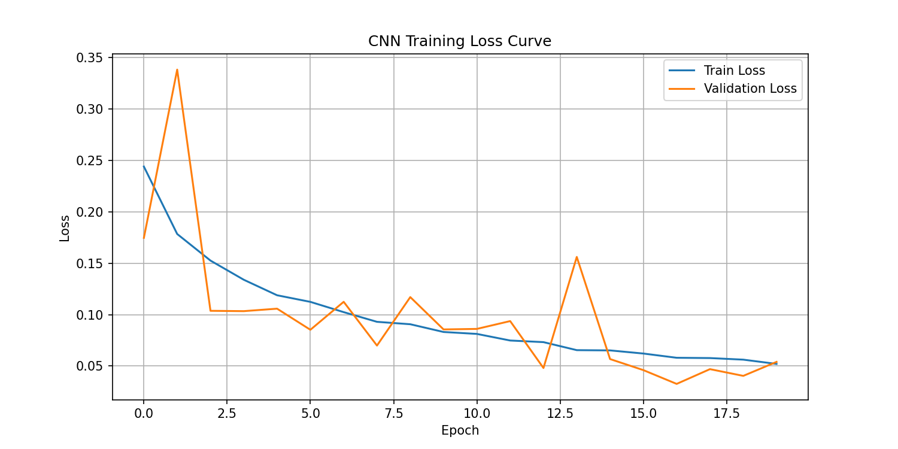
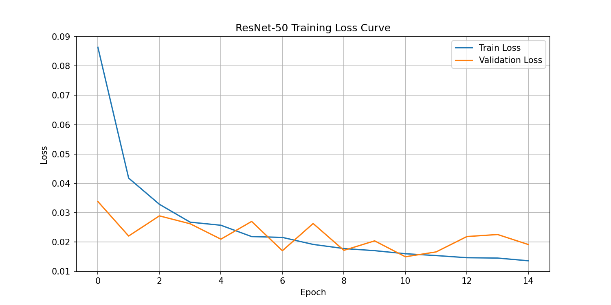

# Terravision · 遥感图像多标签土地类型分类系统

基于 EuroSAT 数据集的遥感图像**多标签分类**：从零搭建 Custom CNN，并与 ImageNet 预训练的
ResNet-50 做迁移学习对照，配套一个 Electron 桌面端可视化应用。

> 课程小组项目（4 人）中 **本人负责的部分**：深度学习模型训练与评估（`code/`）＋ 桌面端应用（`desktop/`）。
> 数据索引由组内同学提供，此处不含他人的代码与报告。

---

## 界面预览



| 模型性能对比 | 单图预测（ResNet-50） | 单图预测（Custom CNN） |
| :---: | :---: | :---: |
|  |  |  |

> ▶ [**查看完整演示视频（5 分钟）**](demo/terravision-demo.mp4) —— 模型对比 → 数据看板 → 单图预测全流程。

## 项目背景

遥感图像与普通照片最大的区别是：**一张图里往往同时包含多种地物**。
EuroSAT 数据集本身是 10 类单标签，但一张 `AnnualCrop` 的图像同时也是 `Vegetation` 和 `OpenLand`。
单标签范式会丢掉这层信息，所以本项目把它重构成 **10 主标签 + 7 辅助标签 = 17 维多标签**体系：

| 主标签 | 派生辅助标签 |
| --- | --- |
| AnnualCrop / HerbaceousVegetation / Pasture / PermanentCrop | Vegetation, OpenLand |
| Forest | Vegetation, NaturalArea |
| Highway | Artificial, Transportation |
| Industrial / Residential | Artificial, Urban |
| River / SeaLake | Water, NaturalArea |

## 数据集

- 来源：[EuroSAT](https://github.com/phelber/EuroSAT)（Sentinel-2 卫星影像）
- 规模：10 类，约 27,000 张，64×64 RGB
- 划分：训练 / 验证 / 测试 = 8 : 1 : 1

数据集本身不随仓库分发，请从上表链接自行下载，并按 `data_dir/<类名>/*.jpg` 的目录结构放置。

## 模型

| | Custom CNN | ResNet-50（迁移学习） |
| --- | --- | --- |
| 结构 | 4 层卷积块 `Conv2d → BatchNorm2d → ReLU → MaxPool2d`，通道 32→64→128→256；分类头 `Flatten(4096) → 512 → Dropout(0.5) → 256 → Dropout(0.3) → 17` | `torchvision.models.resnet50(weights=IMAGENET1K_V1)`，`fc` 改为 `2048 → 17` |
| 损失 | `BCEWithLogitsLoss`（输出 raw logits，不接 Sigmoid，数值更稳定） | 同左 |
| 优化器 | Adam, lr = 1e-3 | Adam, lr = 1e-4 |
| 训练轮数 | 20 | 15 |

- 学习率调度：`ReduceLROnPlateau`（验证损失连续 3 个 epoch 不下降则 ×0.5）
- 早停：以验证损失最低点保存最优权重
- 数据增强：随机水平翻转、随机垂直翻转、±15° 旋转、ColorJitter
- 归一化：ImageNet 统计量 `mean=[0.485,0.456,0.406] std=[0.229,0.224,0.225]`

训练完成后会调用 `get_features()` 导出 **2048 维 GAP 深度特征**（`.npy`），供组内的特征融合实验使用。

## 结果（测试集）

| 模型 | mAP | Macro F1 | Micro F1 | Hamming Loss |
| --- | --- | --- | --- | --- |
| ResNet-50 | **0.9982** | **0.9877** | **0.9914** | **0.0031** |
| Custom CNN | 0.9862 | 0.9475 | 0.9601 | 0.0140 |

> 原始输出见 [`results/dl_results.csv`](results/dl_results.csv)。

**结论**：
1. ResNet-50 在全部指标上领先，说明 ImageNet 预训练特征对遥感小图有很强的可迁移性；
2. Micro F1 > Macro F1，原因是辅助标签（如 Vegetation）样本量大、学得更准；
3. mAP 高于 Macro F1 是因为 mAP 衡量的是排序质量，不依赖 0.5 这一硬阈值。




## 桌面端应用 Terravision

Electron 三层架构，`contextIsolation: true` + `nodeIntegration: false`，通过 `preload.js`
的 `contextBridge` 暴露 IPC 接口：

```
desktop/
├── main.js        主进程：窗口管理 + IPC（选图 / 选文件夹 / 读文件 / 导出 CSV）
├── preload.js     上下文桥，向渲染层暴露受控 API
└── renderer/      渲染层：index.html + css/style.css + js/api.js + js/app.js
```

功能：单图预测（拖拽 / Ctrl+V 粘贴 / 文件对话框导入）、置信度阈值滑块、GradCAM 解释、
批量预测与 CSV 导出、模型对比、4 套主题皮肤。

## 快速开始

### 1. 训练

```bash
pip install torch torchvision numpy scikit-learn matplotlib pillow

# 按实际情况修改 train_complete.py 顶部的 data_dir / indices_dir / save_dir
python code/train_complete.py
```

输出：`results/cnn_best.pth`、`results/resnet50_best.pth`、`results/dl_results.csv`、
`figures/*_loss_curve.png`、`features/resnet_features_*.npy`。

### 2. 桌面端

```bash
cd desktop
npm install
npm start          # 或 npm run dev 打开 DevTools
```

桌面端默认请求 `http://127.0.0.1:8000` 的推理后端；后端未启动时会自动降级为演示数据，
界面照常可用。可通过界面上的设置项修改后端地址。

## 踩过的坑（部署阶段）

1. 后端里 `CustomCNN` 只定义了 3 层卷积且缺少 BatchNorm，与训练时保存权重不匹配 → 加载报错；
2. ResNet-50 加载权重时误用 `weights=None` + `strict=False`，预训练权重被静默跳过；
   且 `fc` 被写成 `nn.Sequential(Linear, Sigmoid)`，与训练时的 `nn.Linear` 对不上；
3. 推理阶段缺少 Sigmoid 转换（训练用 `BCEWithLogitsLoss` 输出的是 logits），
   需手动 `1.0 / (1.0 + np.exp(-logits))`。

三条都属于"训练能跑通、部署才暴露"的问题，最终通过对比训练/推理两端的网络定义与
逐层核对权重形状定位并修复。
